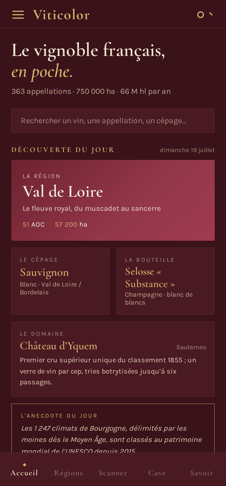
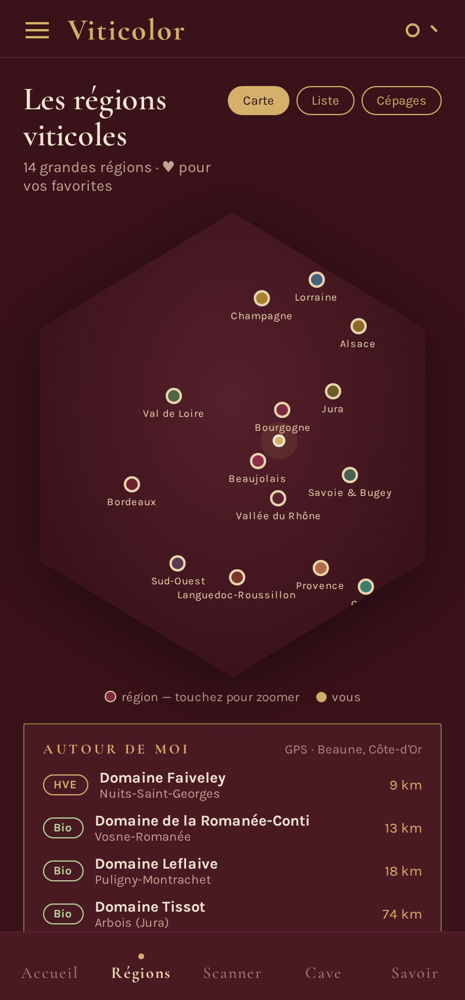
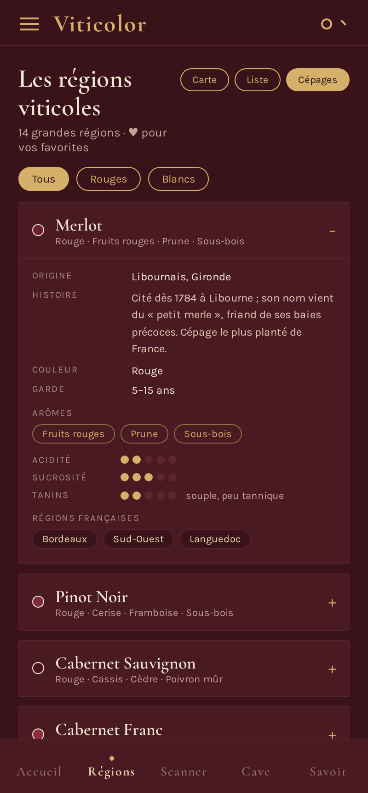
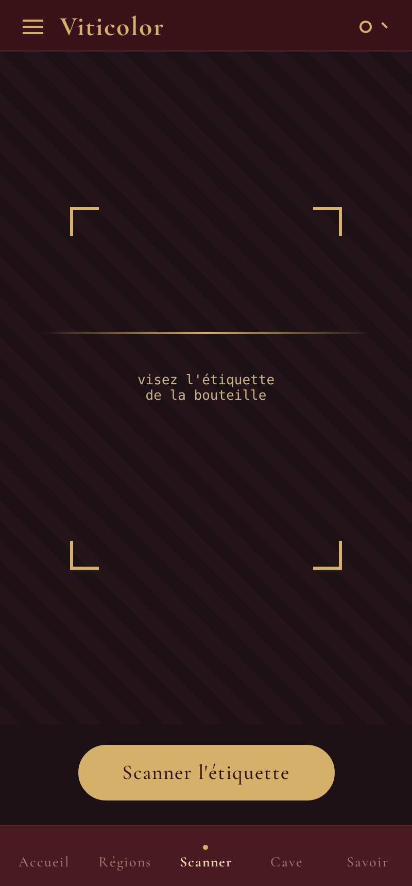
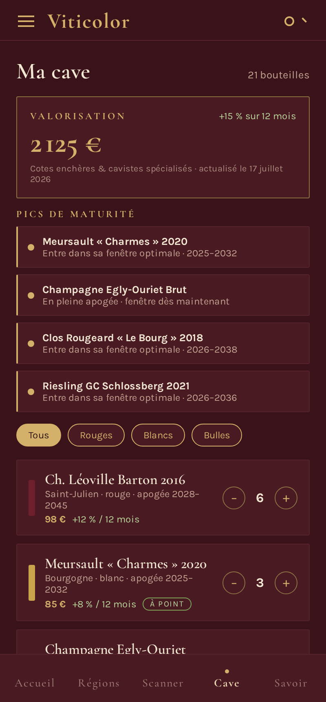
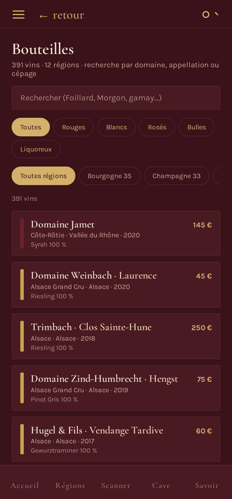

<p align="center">
  
</p>

<h1 align="center">Viticolor</h1>

<p align="center">
  <strong>Le compagnon sommelier du vignoble français — dans votre poche. 🍷</strong>
</p>

<p align="center">
  PWA mobile · <em>offline-first</em> · sans backend · 100 % données embarquées
</p>

<p align="center">
  
  
  
  
  
</p>

---

## ✨ En bref

**Viticolor** est une application web progressive (PWA) qui met tout le vignoble français
dans votre poche : 14 régions, leurs cépages, leurs millésimes et un catalogue de vins
enrichi en continu. Elle s'installe comme une app native, fonctionne **hors-ligne** et ne
dépend d'**aucun serveur** — toutes les données sont embarquées et l'état personnel
(cave, dégustations, favoris) vit dans le `localStorage`.

## 📱 Aperçu

<table>
  <tr>
    <td align="center" width="33%"><br><sub><b>Accueil</b> · découverte du jour</sub></td>
    <td align="center" width="33%"><br><sub><b>Régions</b> · carte interactive</sub></td>
    <td align="center" width="33%"><br><sub><b>Cépages</b> · fiches détaillées</sub></td>
  </tr>
  <tr>
    <td align="center" width="33%"><br><sub><b>Scanner</b> · reconnaissance d'étiquette</sub></td>
    <td align="center" width="33%"><br><sub><b>Ma cave</b> · valorisation & apogée</sub></td>
    <td align="center" width="33%"><br><sub><b>Bouteilles</b> · le catalogue (391 vins)</sub></td>
  </tr>
</table>

<sub>Captures réelles de l'application (build de production), régénérables via <code>npm run screenshots</code>.</sub>

## 🧭 Fonctionnalités

- 🗺️ **Régions & terroirs** — carte interactive des 14 régions, atlas (histoire, climat, sols, domaines, villages).
- 🍇 **Cépages & millésimes** — fiches sensorielles, profils de garde, historique des grandes années.
- 📷 **Scanner d'étiquette** — visez une bouteille, obtenez sa fiche complète (cépages, degré, prix, accords).
- 🍾 **Ma cave** — inventaire valorisé, badges d'apogée, suivi des pics de maturité.
- 📖 **Carnet de dégustation** — notes structurées (robe, nez, bouche, longueur, équilibre, plaisir).
- 🍽️ **Accords mets & vins**, **arômes**, **histoire**, **routes des vins**, **quiz** et **glossaire**.
- 🔎 **Bouteilles** — le catalogue complet, avec recherche (domaine / appellation / cépage) et filtres couleur & région.
- 📶 **Offline-first** — précache complet du shell applicatif et des données, utilisable sans réseau.

## 🍷 Le catalogue

**391 vins · 202 producteurs · 12 régions renseignées sur 14**, enrichis via un pipeline
d'ingestion maison (`app/scripts/ingest-wines.mjs`).

| Région | Vins | Région | Vins |
| --- | :---: | --- | :---: |
| 🏔️ Savoie & Bugey | 52 | 🐚 Corse | 32 |
| ☀️ Vallée du Rhône | 35 | 🟡 Jura | 31 |
| 🍂 Bourgogne | 35 | 🏰 Val de Loire | 31 |
| 🥨 Alsace | 34 | 🍇 Beaujolais | 30 |
| 🥂 Champagne | 33 | 🌿 Languedoc-Roussillon · Provence · Lorraine | 26 chacune |

<p>
  
  
  
  
  
</p>

> 🚧 Régions restant à charger : **Bordeaux** et **Sud-Ouest**.

## 🚀 Démarrage rapide

```bash
cd app
npm install
npm run dev        # développement  → http://localhost:5173
npm run build      # build de production → app/dist
npm run preview    # prévisualiser le build
npm test           # rendu SSR de tous les écrans (garde-fou)
npm run typecheck  # vérification TypeScript stricte
```

## 📦 Installer l'application

Viticolor est une **PWA installable**. Ouvrez le build servi (ou le site déployé) dans un
navigateur, puis **« Ajouter à l'écran d'accueil »** / **« Installer l'application »**.
Elle apparaît alors avec son icône dédiée et se lance en plein écran, hors-ligne :

<p align="left">
  
</p>

## 🗂️ Structure du dépôt

| Dossier / fichier | Rôle |
| --- | --- |
| **`app/`** | L'application (code, données, scripts, PWA). Détails techniques dans [`app/README.md`](app/README.md). |
| `app/src/screens/` | Les écrans React. |
| `app/src/data/*.json` | Données embarquées (régions, atlas, cépages, millésimes, **`wines.json`**…). |
| `app/scripts/ingest-wines.mjs` | Pipeline d'ingestion du catalogue (gabarit texte → `wines.json`). |
| **`design_handoff_viticolor/`** | Handoff de référence (prototype HTML haute-fidélité + captures) ayant servi à recréer l'app. |
| **`CONTEXT.md`** | État du projet pour **reprendre le travail** (décisions, conventions, catalogue, TODO). |
| **`CHANGELOG.md`** | Journal chronologique des changements. |

## 🛠️ Stack technique

**React 18** + **Vite 5** + **TypeScript strict**, sans dépendance runtime au-delà de
React. Store maison (observable + `useSyncExternalStore`), persistance `localStorage`
(préfixe `viticolor_`), PWA offline-first via `vite-plugin-pwa` (Workbox).

## 🧭 Prochaines étapes

- [ ] Charger les dernières régions : **Bordeaux**, **Sud-Ouest**.
- [ ] Brancher le **scanner** (OCR) sur le catalogue pour renvoyer un vrai vin.
- [ ] Exposer le catalogue dans la **recherche globale**.

---

<p align="center"><sub>Fait avec 🍇 pour les amoureux du vignoble français.</sub></p>
